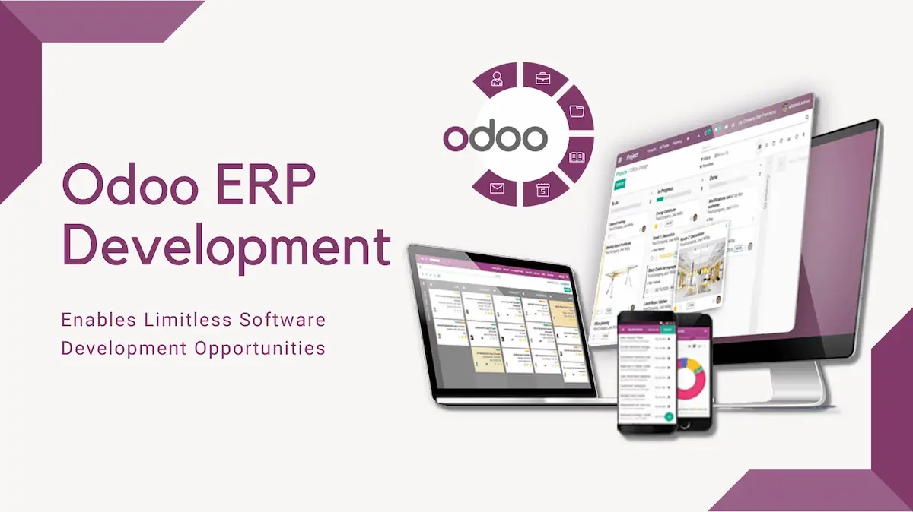
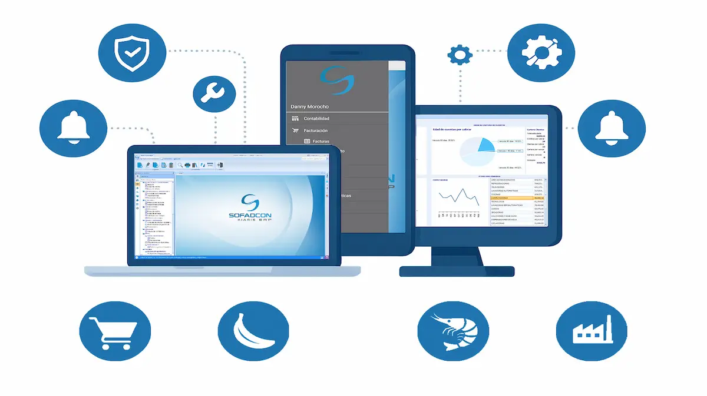
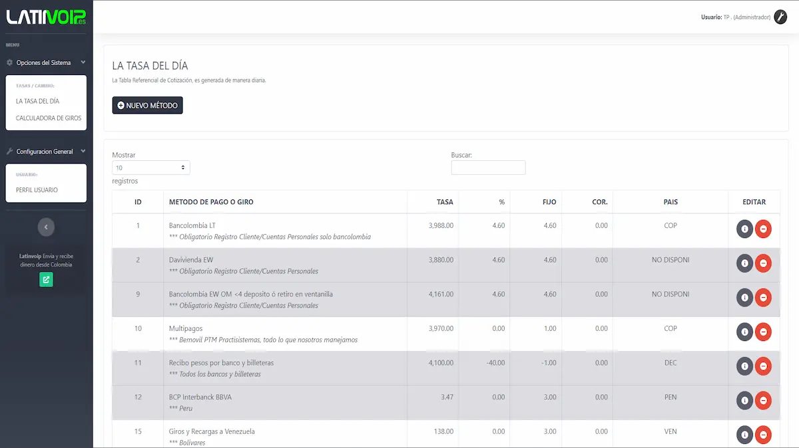

# Desarrollador de Software | Full-Stack | Innovación

  
  
  
  
  
  
  
  
  
  
  
  
  
  

---

### 👋 ¡Hola, soy Jonás!

Soy desarrollador de software e Ingeniero de Sistemas. Me dedico a crear soluciones tecnológicas de principio a fin, combinando eficiencia e innovación. Siempre estoy aprendiendo sobre nuevas herramientas y tecnologías para aplicarlas a problemas reales

---

### 🛠️ Stack Tecnológico

Mi experiencia abarca un amplio espectro de tecnologías, permitiéndome diseñar, desarrollar y desplegar soluciones de software robustas y escalables.

**Lenguajes de Programación**
* **Python:** Desarrollo de backends, scripts y automatización de procesos.
* **C#:** Creación de aplicaciones de alto rendimiento dentro del ecosistema .NET.
* **JavaScript:** Construcción de interfaces de usuario dinámicas y modernas para la web.
* **Dart:** Desarrollo de aplicaciones multiplataforma de alto rendimiento con Flutter.

**Frameworks y Plataformas**
* **Odoo (v16-18):** Amplia experiencia en el desarrollo y personalización de módulos ERP, utilizando su framework y la **Odoo Web Library (OWL)** para el frontend.
* **.NET:** Desarrollo de aplicaciones web, de escritorio y APIs con **ASP.NET Core**, y aplicaciones web interactivas con **Blazor**.
* **Flutter:** Creación de interfaces nativas compiladas para móvil, web y escritorio desde una única base de código.
* **Node.js:** Construcción de servicios backend y APIs eficientes.
* **Frontend Web:** Experiencia con librerías como **React** y **Vue.js** para el desarrollo de Single Page Applications (SPA).

**Bases de Datos**
* **Relacionales:** Sólida experiencia en diseño, optimización y gestión de **SQL Server**, **PostgreSQL** y **MySQL**.
* **NoSQL:** Manejo de bases de datos orientadas a documentos como **MongoDB** para soluciones que requieren flexibilidad y escalabilidad.

**DevOps, Cloud y Arquitecturas**
* **Contenerización:** Uso de **Docker** para crear, gestionar y desplegar aplicaciones en contenedores, garantizando la consistencia entre entornos.
* **Arquitectura de APIs:** Diseño y construcción de **APIs RESTful** seguras, eficientes y escalables.
* **CI/CD:** Implementación de flujos de integración y despliegue continuo con herramientas como **GitHub Actions**.
* **Cloud:** Familiaridad con plataformas como **Azure** y **AWS** para el despliegue y gestión de soluciones.
* **Orquestación:** Conocimientos básicos en **Kubernetes** para la automatización del despliegue y escalado de aplicaciones.

---

### 🚀 Proyectos Destacados

<table width="100%">
  <tr>
    <td width="50%" valign="top">
      
       
      <strong>Módulos para Odoo, en NOSOLOTEC S.A.</strong>
      
Desarrollo módulos a medida para Odoo que se ajustan a las necesidades de los clientes de la empresa.

      

        
        
        
      

    </td>
    <td width="50%" valign="top">
      
       
      <strong>Apps Flutter, en NOSOLOTEC S.A.</strong>
      
Aplicación móvil de tipo WMS para un clientes de la empresa.

      

        
        
        
      

    </td>
  </tr>
  <tr>
    <td width="50%" valign="top" >
      
       
      <strong>Contribuciones en SofAdCon Cía. Ltda.</strong>
      
Ex miembro del equipo de desarrollo de SofAdCon en su versión Web y Móbil con .NET (Blazor & MAUI).

      

        
        
        
      

    </td>
     <td width="50%" valign="top">
      
       
      <strong>Calculadora de Giros para LatinVOIP</strong>
      
Aplicación web para el cálculo de comisiones de giros a Colombia, Venezuela y más.

      

        
        
             
      

    </td>
  </tr>
</table>
---

### ⛓️ Explorando el Universo Cripto y Blockchain

  
  
  

Apasionado por el potencial disruptivo de la tecnología blockchain y el ecosistema de las criptomonedas.

* **Investigador Activo:** Profundizando en los fundamentos de la tecnología de contabilidad distribuida (DLT), finanzas descentralizadas (DeFi) y la tokenización de activos.
* **Contratos Inteligentes:** Interesado en el desarrollo y auditoría de contratos inteligentes en plataformas como Ethereum.
* **Bitcoin y Capas de Innovación:** Estudiando las capacidades de Bitcoin como reserva de valor y las soluciones de escalabilidad de segunda capa como la Lightning Network.
### Contacto

    

## 💰 You can help me by Donating
 
