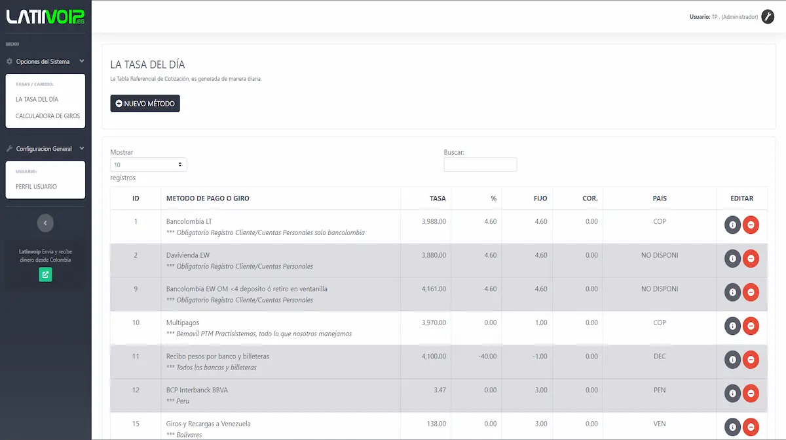

# Software Developer | Full-Stack Engineer

  
  
  
  
  
  
  
  
  
  
  
  
  
  

---

### 👋 ¡Hola, soy Jonás!

I am a Software Developer and Systems Engineer. I design and build end-to-end technological solutions that combine efficiency and innovation. I’m continuously learning new tools and technologies to apply them to real-world problems.

---

### 🛠️ Technology Stack

My experience covers a broad spectrum of technologies, enabling me to design, develop, and deploy robust and scalable software solutions.

**Programming Languages**

* **Python:** Backend development, scripting, and process automation.
* **C#:** Building high-performance applications within the .NET ecosystem.
* **JavaScript:** Developing dynamic, modern web user interfaces.
* **Dart:** Creating high-performance, cross-platform applications using Flutter.

**Frameworks and Platforms**

* **Odoo (v16–18):** Extensive experience in developing and customizing ERP modules, leveraging its framework and the **Odoo Web Library (OWL)** for frontend development.
* **.NET:** Development of web, desktop, and API applications using **ASP.NET Core**, as well as interactive web apps with **Blazor**.
* **Flutter:** Building natively compiled interfaces for mobile, web, and desktop from a single codebase.
* **Node.js:** Developing efficient backend services and APIs.
* **Web Frontend:** Skilled in libraries such as **React** and **Vue.js** for building Single Page Applications (SPAs).

**Databases**

* **Relational:** Strong experience in the design, optimization, and management of **SQL Server**, **PostgreSQL**, and **MySQL**.
* **NoSQL:** Proficient in document-oriented databases such as **MongoDB**, ideal for flexible and scalable solutions.

**DevOps, Cloud, and Architectures**

* **Containerization:** Using **Docker** to build, manage, and deploy containerized applications, ensuring environment consistency.
* **API Architecture:** Designing and developing secure, efficient, and scalable **RESTful APIs**.
* **CI/CD:** Implementing continuous integration and deployment pipelines using tools like **GitHub Actions**.
* **Cloud:** Familiar with **Azure** and **AWS** platforms for solution deployment and management.
* **Orchestration:** Basic knowledge of **Kubernetes** for automating deployment and scaling of applications.

### 🚀 Featured Projects
<table width="100%">
  <tr>
    <td width="50%" valign="top">
      
       
      <strong>Custom Odoo Modules, at NOSOLOTEC S.A.</strong>
      
Developed tailor-made Odoo modules designed to meet the specific needs of the company’s clients.

      

        
        
        
      

    </td>
    <td width="50%" valign="top">
      
       
      <strong>Flutter Apps, at NOSOLOTEC S.A.</strong>
      
Developed a WMS-type mobile application for one of the company’s clients.

      

        
        
        
      

    </td>
  </tr>
  <tr>
    <td width="50%" valign="top" >
      
       
      <strong>Contributions at SofAdCon Cía. Ltda.</strong>
      
Former member of the development team for SofAdCon’s Web and Mobile versions, built with .NET (Blazor & MAUI).

      

        
        
        
      

    </td>
     <td width="50%" valign="top">
      
       
      <strong>Remittance Calculator for LatinVOIP</strong>
      
Web application for calculating remittance commissions to Colombia, Venezuela, and other countries.

      

        
        
             
      

    </td>
  </tr>
</table>
---

### ⛓️ Exploring the Crypto and Blockchain Universe

  
  
  

Passionate about the disruptive potential of blockchain technology and the cryptocurrency ecosystem.

* **Active Researcher:** Exploring the fundamentals of Distributed Ledger Technology (DLT), Decentralized Finance (DeFi), and asset tokenization.
* **Smart Contracts:** Interested in the development and auditing of smart contracts on platforms such as Ethereum.
* **Bitcoin and Innovation Layers:** Studying Bitcoin’s role as a store of value and second-layer scalability solutions like the Lightning Network.

### Contact

    

## 💰 You can help me by Donating
 
