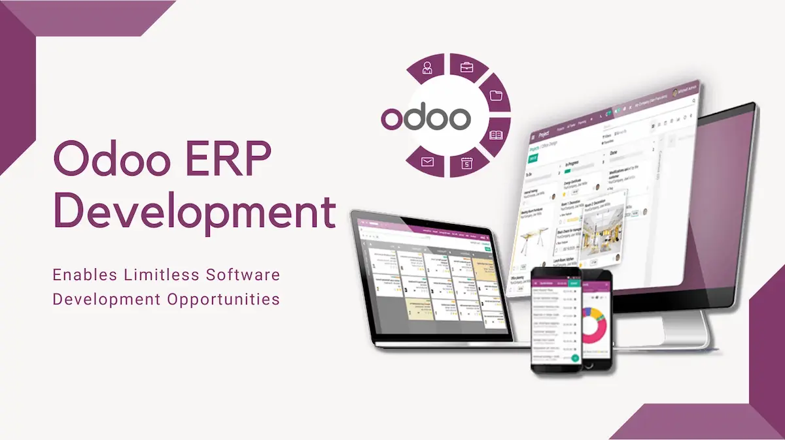
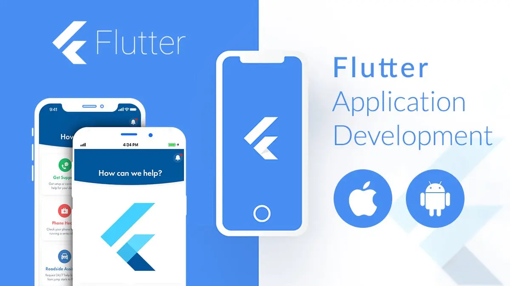
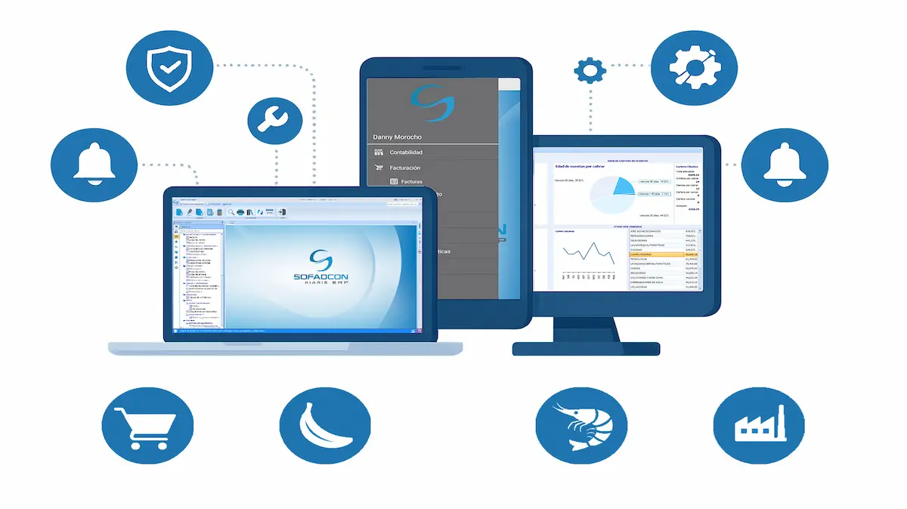
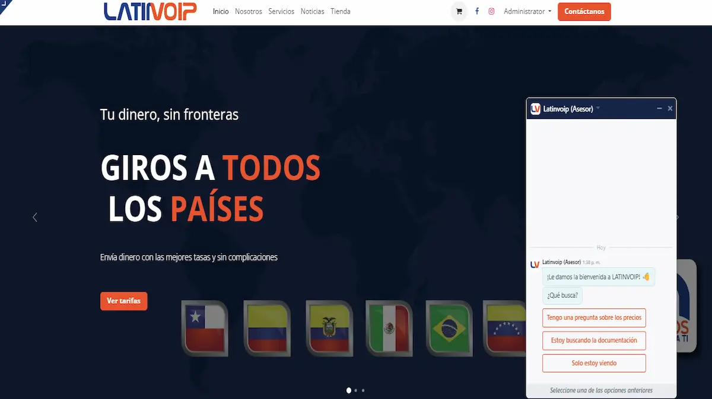

# 👋 Hi, I'm Jonás

## Software Engineer | Odoo & Full-Stack Development

Software engineer specialized in **Odoo ERP, business automation, and full-stack development**.

I build and customize business solutions using **Python, PostgreSQL, OWL, JavaScript, and .NET**, with a strong focus on ERP development, integrations, and process automation.

🏆 **Odoo 17 & 18 Functional Certified**
🚀 **Odoo 19 Project Experience**
🛠️ **Odoo 19 Python Framework & Odoo.sh Technical Training**
🔄 **Ready for Odoo 20**

---

## 🧩 Odoo

**Main specialization:** Odoo ERP development and customization.

* Custom modules & business logic
* Python / Odoo ORM
* OWL & JavaScript
* XML / QWeb
* PostgreSQL
* API & XML-RPC integrations
* Business workflows & automation
* Database optimization
* Version upgrades & adaptations

---

## 🛠️ Tech Stack

**Backend:** Python · Django · C# · .NET · ASP.NET Core · Node.js

**Frontend:** JavaScript · OWL · React · Vue.js · Blazor

**Mobile:** Flutter

**Databases:** PostgreSQL · SQL Server · MySQL · MongoDB

**DevOps & Cloud:** Docker · GitHub Actions · Azure · AWS · Kubernetes

---

## 🚀 What I Build

ERP solutions · Business automation · REST APIs · System integrations · Enterprise applications · Database-driven systems · Cross-platform applications

---
### 🚀 Featured Projects
<table width="100%">
  <tr>
    <td width="50%" valign="top">
      
       
      <strong>Custom Odoo Modules, at NOSOLOTEC S.A.</strong>
      
Developed tailor-made Odoo modules designed to meet the specific needs of the company’s clients.

      

        
        
        
      

    </td>
    <td width="50%" valign="top">
      
       
      <strong>Flutter Apps, at NOSOLOTEC S.A.</strong>
      
Developed a WMS-type mobile application for one of the company’s clients.

      

        
        
        
      

    </td>
  </tr>
  <tr>
    <td width="50%" valign="top" >
      
       
      <strong>Contributions at SofAdCon Cía. Ltda.</strong>
      
Former member of the development team for SofAdCon’s Web and Mobile versions, built with .NET (Blazor & MAUI).

      

        
        
        
      

    </td>
     <td width="50%" valign="top">
      
       
      <strong>Remittance App for Latinvoip</strong>
      
Web application for calculating remittance commissions to Colombia, Venezuela, and other countries.

      

        
        
             
      

    </td>
  </tr>
</table>

---

## ₿ Exploring

Interested in the technical side of **Bitcoin, blockchain, and decentralized systems**, including:

Bitcoin · Lightning Network · DeFi · Tokenization · Ethereum · Smart Contracts

---

## 🔗 Connect

* 💼 [LinkedIn](https://www.linkedin.com/in/jonasbonilla)
* 🌐 [Personal Website](https://jbbonilla.dev/)

---

## 💰 Support My Work

If you find my projects useful and want to support my work, you can donate below.
